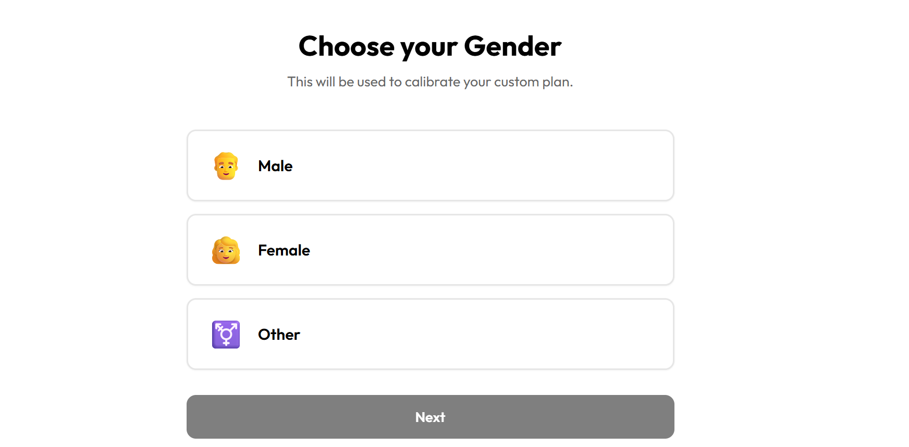
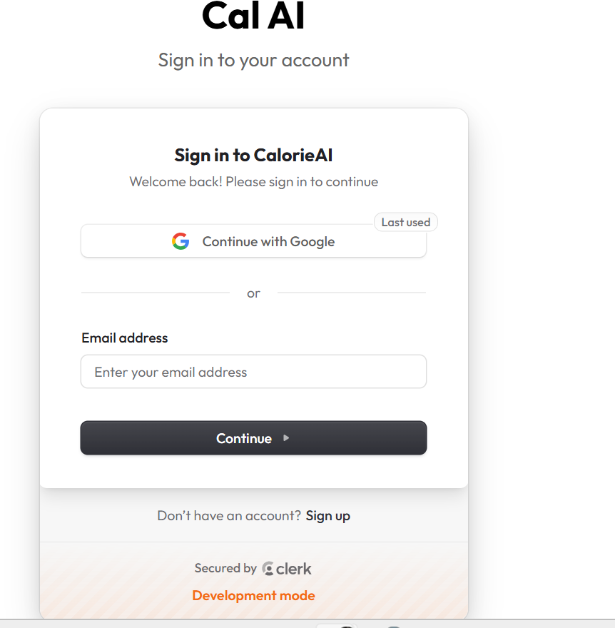
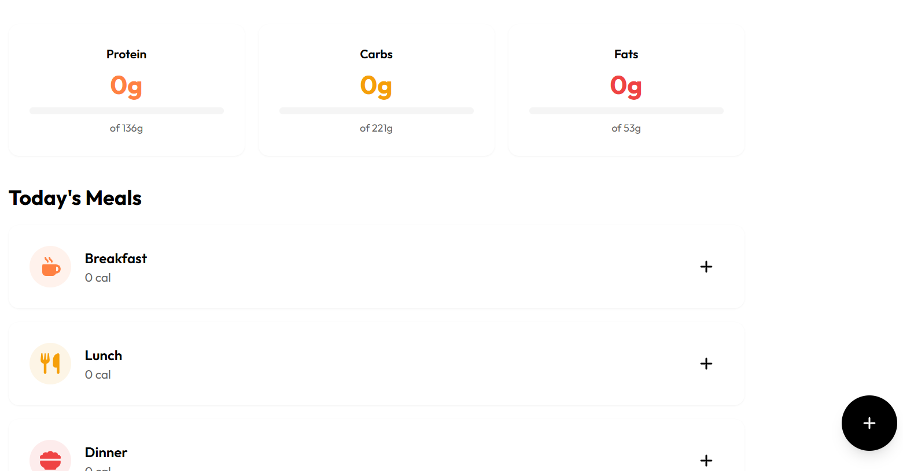
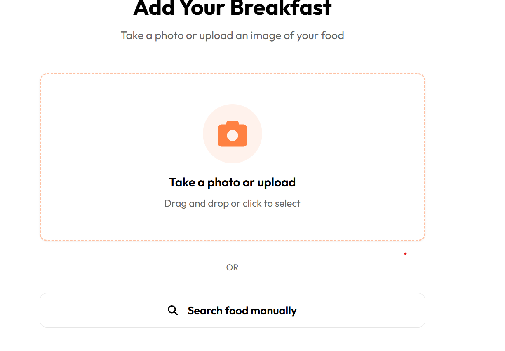

# 🥗 Calorie Tracker (CalorieAI)
**Calorie Tracker** is a modern web application that helps users track their meals, analyze nutritional content, and maintain a healthy lifestyle. The app supports breakfast, lunch, dinner, and snacks tracking with image-based meal analysis.  

Built with **TypeScript, React, Supabase, Clerk, and n8n workflows** for a seamless and intelligent experience.

---


## 🌟 Features

- **User Authentication** with [Clerk](https://clerk.dev/)  
- **Meal Tracking** for breakfast, lunch, dinner, and snacks  
- **Image-based Nutrition Analysis** powered by [n8n](https://n8n.io/) workflows  
- **Data Storage** and retrieval using [Supabase](https://supabase.com/)  
- **Responsive UI** built with React and TSX  
- **Personalized Dashboard** with nutritional insights  

## 🖼️ Screenshots

**Dashboard/Landing Page:**  


**Flow:**  


**Login/Signup(Clerk)**  


**Meal Summary:**  


**Meal Logging:**  


## 💻 Tech Stack

| Layer | Technology |
|-------|------------|
| Frontend | React, TypeScript, TSX |
| Authentication | Clerk |
| Database | Supabase |
| Backend Workflow | n8n |
| Styling | Tailwind CSS |
| Deployment | Vercel / Netlify (optional) |

---

## ⚡ How It Works

1. **Authentication:** Users sign up or log in via Clerk.  
2. **Meal Tracking:** Users log meals manually or upload meal images.  
3. **Image Analysis:** n8n workflows process the uploaded image to extract nutritional data.  
4. **Database Storage:** Supabase stores the meal data and nutrition info.  
5. **Dashboard:** Users view daily, weekly, and monthly calorie intake with insights.

---

## 🚀 Getting Started

### Prerequisites
- Node.js >= 18
- npm / pnpm / yarn
- Supabase account
- Clerk account
### Installation

```bash
# Clone the repo
git clone https://github.com/Nish2005karsh/Calorie-tracker.git
cd Calorie-tracker
```
```bash
# Install dependencies
npm install
```
```bash
# Copy env variables
cp .env.example .env
```
```bash
# Run locally
npm run dev
```

## Environment Variables(.env)
```bash
SUPABASE_URL=your_supabase_url
SUPABASE_ANON_KEY=your_supabase_anon_key
CLERK_FRONTEND_API=your_clerk_frontend_api
CLERK_API_KEY=your_clerk_api_key
```

## Deployment

Frontend: Vercel / Netlify

Backend Workflows: n8n hosted locally or on a server
Database: Supabase


## License

[MIT](https://choosealicense.com/licenses/mit/)

