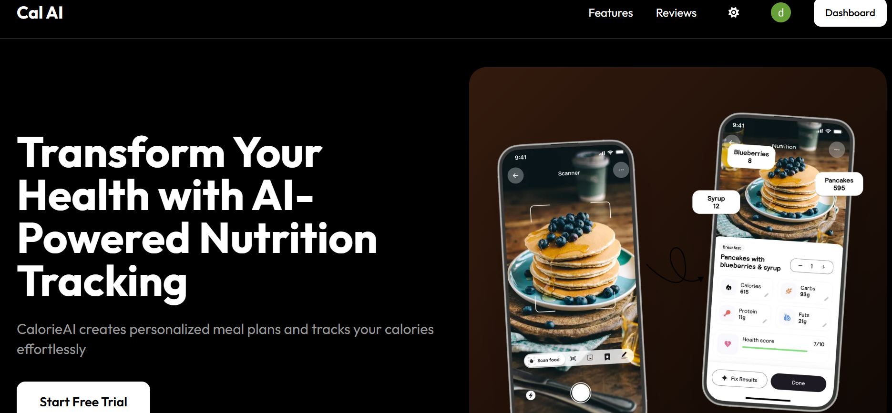
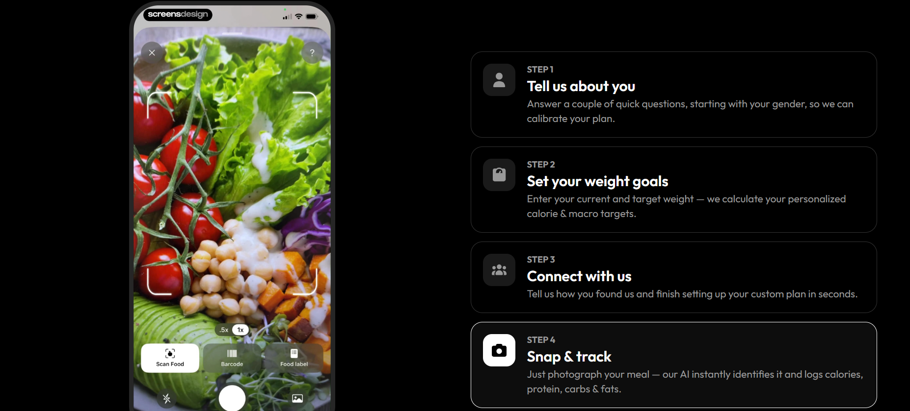
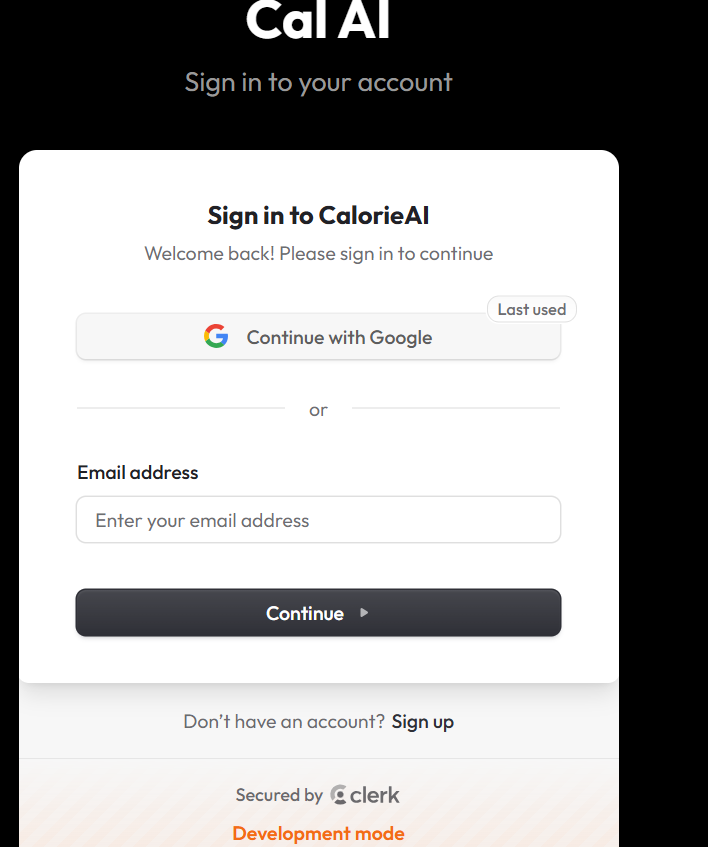
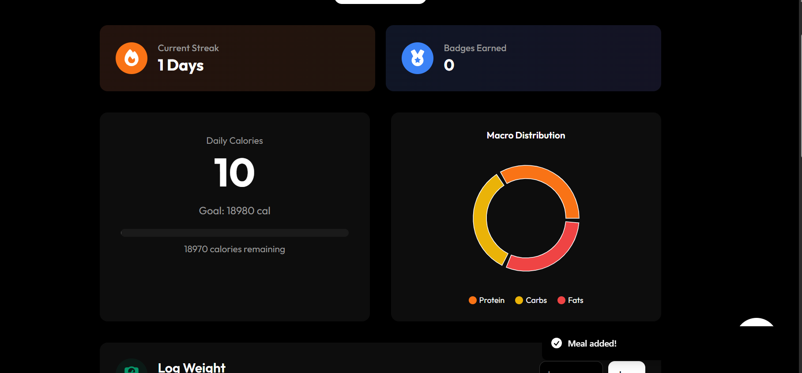
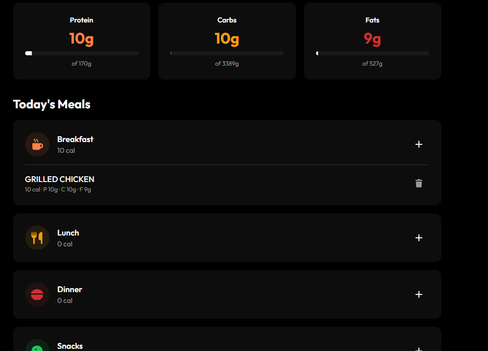
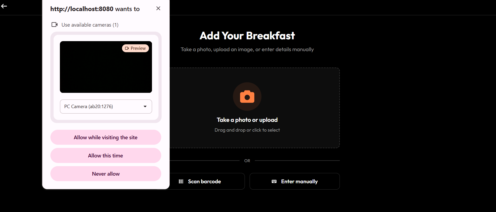
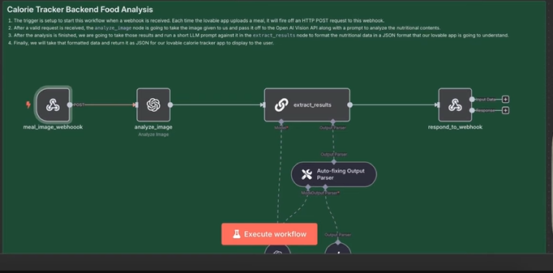

# 🥗 CalorieAI — Your Smart Nutrition Tracker

> Snap a photo of your meal and let AI instantly log its calories and macros. CalorieAI turns nutrition tracking from a tedious chore into a one-tap habit — with personalized goals, streaks, analytics, and more.

<p align="center">
  
  
  
  
  
  
  
  
</p>

---

## 📖 What is CalorieAI?

CalorieAI is a modern web app that helps you eat healthier without the friction of manual food logging. Instead of searching databases and guessing portion sizes, you simply **take a photo of your food** — an AI vision model identifies the meal and estimates its full nutritional breakdown (calories, protein, carbs, fat, fiber, sugar, sodium) plus a health score.

Around that core, the app gives you everything you need to actually stick with your goals: a personalized calorie & macro plan, a daily dashboard, water and weight tracking, a streak-and-badge system to keep you motivated, and rich analytics over time.

**In one sentence:** *Onboard → get a personalized plan → snap your meals → watch your progress.*

---

## 🖼️ Screenshots

| Landing Page | Onboarding Flow | Authentication (Clerk) |
|:---:|:---:|:---:|
|  |  |  |

| Personalized Plan | Meal Logging | Dashboard & Insights |
|:---:|:---:|:---:|
|  |  |  |

> The original AI pipeline was built as an **n8n workflow** (shown below). It has since been **fully reimplemented in application code** — see [How the AI works](#-how-the-ai-works).
>
> 

---

## 🌟 Features

- 📸 **AI meal recognition** — photograph your food and get instant calories, macros, a confidence score, and a health rating.
- ⌨️ **Manual entry** — type in a meal's nutrition by hand when you prefer.
- 🔖 **Barcode scanning** — scan a packaged product's barcode to auto-fill nutrition from the [Open Food Facts](https://world.openfoodfacts.org/) database.
- 🎯 **Personalized goals** — your daily calorie & macro targets are computed from your body stats and goals using the **Mifflin-St Jeor** equation (not hardcoded guesses).
- 📊 **Daily dashboard** — calories remaining, macro distribution donut, per-meal breakdown, and day-by-day navigation.
- 🗓️ **Calendar view** — a color-coded month grid showing how each day measured against your goal.
- 📈 **Analytics** — weekly/monthly calorie trends, macro trends, and a weight-progress chart.
- 🔥 **Streaks & badges** — build a logging habit and unlock milestone badges (3, 7, 10, 14, 21 days).
- 💧 **Water tracking** — log your daily glasses toward a hydration goal.
- ⚖️ **Weight tracking** — log weigh-ins and visualize the trend over time.
- ⚙️ **Settings** — edit goals/weights, recalculate your plan, switch units, and manage your account.
- 🌗 **Dark mode** — light / dark / system theme.
- 🔐 **Secure auth** — sign-up/sign-in via Clerk, with per-user data isolation enforced by Supabase Row-Level Security.

---

## ⚡ How It Works

1. **Sign up** with Clerk (email or social login).
2. **Onboard** — a short, guided flow asks for your gender, body stats, weight goal, activity level, and pace. From this, CalorieAI generates a personalized calorie & macro plan.
3. **Log meals** — snap a photo, scan a barcode, or type it in. The AI fills in the nutrition; you review and save.
4. **Track everything** — meals, water, and weight all roll up into your daily dashboard.
5. **Stay motivated** — keep your streak alive, earn badges, and watch your trends in Analytics.

---

## 🤖 How the AI Works

CalorieAI's nutrition analysis is powered by **Google Gemini's** vision model, called **directly from the app**.

> **Note on the architecture change:** the meal-analysis pipeline was originally built as a hosted **n8n workflow** (a webhook that called an LLM vision API and a second LLM to format the result — pictured in the screenshot above). When that hosting was retired, the entire workflow was **rebuilt natively in the codebase**. There is no external webhook anymore — everything runs in our own code.

The current flow ([`src/lib/gemini.ts`](./src/lib/gemini.ts)):

1. The meal image is converted to base64 in the browser.
2. It's sent to Gemini with a detailed "AI Nutrition Analyst" prompt.
3. Gemini's **structured-output** feature (`responseSchema`) returns strictly-typed JSON in a **single call** — collapsing what used to be two separate n8n nodes (vision analysis + JSON formatting) into one.
4. The validated result (`mealName`, `calories`, `protein`, `carbs`, `fat`, `fiber`, `sugar`, `sodium`, `confidenceScore`, `healthScore`, `rationale`) is shown for review and saved to Supabase.

---

## 💻 Tech Stack

| Layer | Technology |
|-------|------------|
| Frontend | React 18, TypeScript, Vite |
| UI | Tailwind CSS, shadcn/ui, Recharts, Motion |
| Authentication | [Clerk](https://clerk.com/) |
| Database | [Supabase](https://supabase.com/) (Postgres + Row-Level Security) |
| AI / Vision | [Google Gemini](https://ai.google.dev/) |
| Barcode lookup | [Open Food Facts](https://world.openfoodfacts.org/) + ZXing |
| Deployment | Vercel |

---

## 🚀 Getting Started

### Prerequisites
- Node.js >= 18
- A free [Supabase](https://supabase.com/) project
- A free [Clerk](https://clerk.com/) application
- A [Google AI Studio](https://aistudio.google.com/app/apikey) (Gemini) API key

### 1. Clone & install
```bash
git clone https://github.com/Nish2005karsh/Calorie-tracker.git
cd Calorie-tracker
npm install
```

### 2. Set up the database
In your Supabase project, open the **SQL Editor** and run the contents of [`supabase_setup.sql`](./supabase_setup.sql). This creates all tables (`daily_meals`, `user_profiles`, `user_streaks`, `user_badges`, `weight_logs`, `water_logs`) and their Row-Level-Security policies in one go.

### 3. Connect Clerk to Supabase (Third-Party Auth)
So Supabase trusts Clerk-issued logins:
1. In **Clerk** → enable the **Supabase integration** and copy your **Clerk domain** (e.g. `https://your-app.clerk.accounts.dev`).
2. In **Supabase** → **Authentication → Third-Party Auth** → **Add provider → Clerk**, and paste that domain.

### 4. Configure environment variables
Create a `.env.local` file in the project root:

```bash
# Supabase
VITE_SUPABASE_URL=https://your-project.supabase.co
VITE_SUPABASE_ANON_KEY=your_supabase_publishable_key

# Clerk
VITE_CLERK_PUBLISHABLE_KEY=pk_test_your_clerk_key

# Google Gemini
VITE_GEMINI_API_KEY=your_gemini_api_key
# Optional: override the model (default: gemini-2.0-flash)
# VITE_GEMINI_MODEL=gemini-2.0-flash
```

### 5. Run it
```bash
npm run dev
```
Open the local URL Vite prints (usually `http://localhost:8080`).

---

## ☁️ Deployment (Vercel)

1. Push the repo to GitHub and import it into [Vercel](https://vercel.com/) (it auto-detects Vite — build command `npm run build`, output `dist`).
2. Add the same environment variables from `.env.local` under **Settings → Environment Variables**.
3. Deploy, then add your `*.vercel.app` URL to Clerk's allowed origins.

> SPA routing is handled by [`vercel.json`](./vercel.json) so deep links (e.g. `/dashboard`) work on refresh.

---

## 📁 Project Structure

```
src/
├─ pages/                 # Route screens
│  ├─ Landing.tsx         # Marketing page (hero, how-it-works, features, testimonials)
│  ├─ Dashboard.tsx       # Daily overview: calories, macros, meals, water, streaks
│  ├─ Analytics.tsx       # Trend charts
│  ├─ Calendar.tsx        # Month grid of daily intake
│  ├─ Settings.tsx        # Goals, units, theme, account
│  ├─ onboarding/         # Guided multi-step onboarding flow
│  └─ dashboard/AddMeal.tsx  # Photo / barcode / manual meal entry
├─ components/            # Reusable UI (Footer, HowItWorks, BarcodeScanner, ui/*)
├─ hooks/                 # useOnboarding, etc.
└─ lib/
   ├─ gemini.ts           # AI meal analysis (replaces the old n8n workflow)
   ├─ openfoodfacts.ts    # Barcode → nutrition lookup
   ├─ goals.ts            # Mifflin-St Jeor calorie & macro calculation
   ├─ supabase.ts         # Supabase client + Clerk third-party auth
   ├─ api.ts              # Meals, profile, weight, water data access
   ├─ streaks.ts          # Streaks & badges
   └─ analytics.ts        # Weekly/monthly aggregation
```

---

## 📜 License

[MIT](https://choosealicense.com/licenses/mit/)
